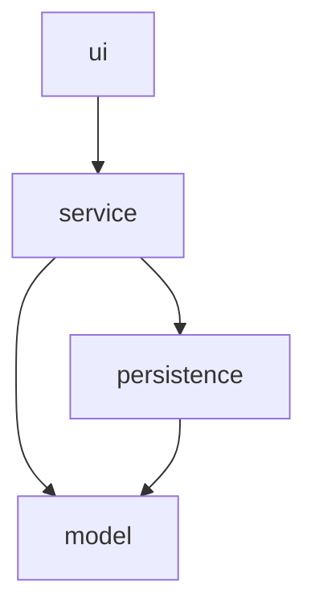

# GameZone Unicesar

Reference implementation of Taller 1, Programación de Computadores III (SS462), Ingeniería de Sistemas, Universidad Popular del Cesar.

## About

GameZone Unicesar is a fictional video game and console store located in Valledupar's university sector. It exists as a teaching scenario: a small retailer that needs to keep track of what it sells, who it sells to, and who sells it.

The system registers products (video games and consoles), people (customers and sellers), and sales, and automatically updates inventory whenever a sale is registered. It is built as a Java console application on a strict four-layer architecture (model, persistence, service, ui) with file-based persistence, so data survives between runs without requiring a database.

## Reference Implementation Notice

This repository is built and maintained by a single Git user (adbautistar) simulating a three-person team workflow, as documented in [TEAM.md](TEAM.md) and [CLAUDE.md](CLAUDE.md). Each simulated developer works on their own feature branch and opens Pull Requests for module integration, exactly as a real team would.

Cross-review of Pull Requests is not simulated; all PRs in this repository are self-approved by the single user executing the reference implementation. This is the only documented deviation from the taller specification, and it applies only to this reference implementation — student teams must comply fully with cross-review of Pull Requests.

## Architecture

The codebase is organized into four layers under `com.gamezone`, with a strict, one-directional dependency rule: `ui → service → persistence → model`. The `model` layer depends on nothing else; `persistence` depends only on `model`; `service` depends on `model` and `persistence`; `ui` depends only on `service`. See [docs/layers-diagram.md](docs/layers-diagram.md) for the full diagram and rationale.



## Requirements

- Java 17 or later
- Maven 3.8 or later
- GitHub CLI (`gh`) — only for reproducing the workflow used to build this repository

## Build

```
mvn clean compile
```

## Run

```
mvn exec:java "-Dexec.mainClass=com.gamezone.Main"
```

Data files under `data/` are created and updated automatically. The file `data/sellers.csv` is preloaded with 3 sellers.

## Extended Modules

Beyond the 10 baseline operations, the system has been extended additively with new modules. Each one is documented in its own `fase-1X-*.md` specification (not tracked in git) and summarized in [CLAUDE.md](CLAUDE.md#class-inventory-35-classes-total-15-baseline--20-from-extended-modules).

### Accessory Module (v1.1.0)

Adds `Accessory` (abstract, extends `Product`) with three concrete types — `Controller`, `Cable`, and `Memory` — each tracking which consoles it is compatible with. Accessories have their own catalog (`AccessoryRepository`/`AccessoryService`, backed by `data/accessories.csv`, preloaded with 3 entries) and can be included in a sale alongside regular products: when registering a sale, product and accessory ids can be entered interchangeably.

New menu operations (option 4 — Gestion de accesorios):
1. Registrar un nuevo control
2. Registrar un nuevo cable
3. Registrar una nueva memoria
4. Listar todos los accesorios
5. Listar accesorios por tipo
6. Consultar accesorios compatibles con una consola

### Promotion Module (v1.2.0)

Adds `Promotion` (abstract) with three concrete discount strategies — `PercentageDiscount` (flat percentage of the total), `CategoryDiscount` (percentage restricted to video games or consoles), and `BulkPurchaseDiscount` (percentage granted only above a minimum item count). Promotions have their own catalog (`PromotionRepository`/`PromotionService`, backed by `data/promotions.csv`, preloaded with 3 entries). When registering a sale, the system automatically finds and applies the single best active promotion (the one yielding the largest discount) — no manual selection is needed. Discount details (subtotal, promotion name, discount amount, final total) appear in the sale receipt whenever a promotion was applied.

New menu operations (option 5 — Gestion de promociones):
1. Registrar una nueva promocion por porcentaje
2. Registrar una nueva promocion por categoria
3. Registrar una nueva promocion por volumen
4. Listar todas las promociones
5. Listar promociones vigentes

### Return Module (v1.3.0)

Adds `Return` (concrete), representing the return of one or more products from a previously registered sale. Returns are partial: a customer can return just one or a subset of the products in a multi-product sale, not necessarily the whole sale. Registering a return validates that the sale exists, that it is within 30 days of its sale date (`Sale.canBeReturned()`), and that every product being returned actually belongs to that sale — then automatically restores stock for each returned item (via `ProductService.restoreStock` or `AccessoryService.updateStock`, depending on the item's type) and computes the refund as the sum of the returned products' prices. Returns are backed by `data/returns.csv` (`ReturnRepository`/`ReturnService`), starting empty.

New menu operations (option 6 — Gestion de devoluciones):
1. Registrar una nueva devolucion
2. Ver todas las devoluciones
3. Ver devoluciones por cliente
4. Ver devoluciones por venta

New menu operation (option 7 — Consultar balance mensual): reports total sales minus total refunds for a given month and year.

### Warranty Module (v1.4.0)

Adds `Warranty` (abstract) with two concrete types: `BasicWarranty` (6 months, no additional cost) and `ExtendedWarranty` (12 months, 10% of the product's price). A basic warranty is generated automatically for every console included in a sale — no action needed from the seller. During sale registration, the seller is also asked whether to add an extended warranty for each console; if accepted, its 10% surcharge is added to the sale total on top of any product prices (and any promotion discount already applied). Warranties are backed by `data/warranties.csv` (`WarrantyRepository`/`WarrantyService`), starting empty.

New menu operations (option 8 — Gestion de garantias):
1. Consultar garantia por producto y venta
2. Listar todas las garantias
3. Listar garantias vigentes
4. Listar garantias proximas a vencer

## Repository Structure

```
GameZoneUnicesar/
├── README.md
├── TEAM.md
├── CLAUDE.md
├── pom.xml
├── .gitignore
├── LICENSE
├── src/
│   └── main/
│       └── java/
│           └── com/
│               └── gamezone/
│                   ├── model/
│                   ├── persistence/
│                   ├── service/
│                   ├── ui/
│                   └── Main.java
├── data/
└── docs/
    ├── analysis.md
    ├── hierarchy-diagram.md
    ├── class-diagram.md
    ├── layers-diagram.md
    └── ai-usage/
        ├── leader-ai-log.md
        ├── developer1-ai-log.md
        └── developer2-ai-log.md
```

## Team Members

See [TEAM.md](TEAM.md) for roles, module ownership, and committed activities.

## Design Documentation

- [Analysis](docs/analysis.md)
- [Hierarchy Diagram](docs/hierarchy-diagram.md)
- [Class Diagram](docs/class-diagram.md)
- [Layers Diagram](docs/layers-diagram.md)
- [Version Control](docs/version-control.md) — branches, full commit log, commits per team member, and Pull Requests

## AI Usage Logs

- [Technical Lead](docs/ai-usage/leader-ai-log.md)
- [Developer 1](docs/ai-usage/developer1-ai-log.md)
- [Developer 2](docs/ai-usage/developer2-ai-log.md)

## License

MIT — see [LICENSE](LICENSE).
