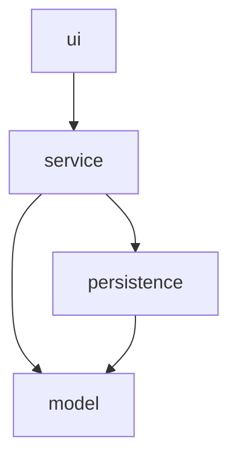

# GameZone Unicesar

Reference implementation of Taller 1, Programación de Computadores III (SS462), Ingeniería de Sistemas, Universidad Popular del Cesar.

## About

GameZone Unicesar is a fictional video game and console store located in Valledupar's university sector. It exists as a teaching scenario: a small retailer that needs to keep track of what it sells, who it sells to, and who sells it.

The system registers products (video games and consoles), people (customers and sellers), and sales, and automatically updates inventory whenever a sale is registered. It is built as a Java console application on a strict four-layer architecture (model, persistence, service, ui) with file-based persistence, so data survives between runs without requiring a database.

## Reference Implementation Notice

This repository is built and maintained by a single Git user (adbautistar) simulating a three-person team workflow, as documented in [TEAM.md](TEAM.md) and [CLAUDE.md](CLAUDE.md). Each simulated developer works on their own feature branch and opens Pull Requests for module integration, exactly as a real team would.

Cross-review of Pull Requests is not simulated; all PRs in this repository are self-approved by the single user executing the reference implementation. This is the only documented deviation from the taller specification, and it applies only to this reference implementation — student teams must comply fully with cross-review of Pull Requests.

## Architecture

The codebase is organized into four layers under `com.gamezone`, with a strict, one-directional dependency rule: `ui → service → persistence → model`. The `model` layer depends on nothing else; `persistence` depends only on `model`; `service` depends on `model` and `persistence`; `ui` depends only on `service`. See [docs/layers-diagram.md](docs/layers-diagram.md) for the full diagram and rationale.



## Requirements

- Java 17 or later
- Maven 3.8 or later
- GitHub CLI (`gh`) — only for reproducing the workflow used to build this repository

## Build

```
mvn clean compile
```

## Run

```
mvn exec:java "-Dexec.mainClass=com.gamezone.Main"
```

Data files under `data/` are created and updated automatically. The file `data/sellers.csv` is preloaded with 3 sellers.

## Repository Structure

```
GameZoneUnicesar/
├── README.md
├── TEAM.md
├── CLAUDE.md
├── pom.xml
├── .gitignore
├── LICENSE
├── src/
│   └── main/
│       └── java/
│           └── com/
│               └── gamezone/
│                   ├── model/
│                   ├── persistence/
│                   ├── service/
│                   ├── ui/
│                   └── Main.java
├── data/
└── docs/
    ├── analysis.md
    ├── hierarchy-diagram.md
    ├── class-diagram.md
    ├── layers-diagram.md
    └── ai-usage/
        ├── leader-ai-log.md
        ├── developer1-ai-log.md
        └── developer2-ai-log.md
```

## Team Members

See [TEAM.md](TEAM.md) for roles, module ownership, and committed activities.

## Design Documentation

- [Analysis](docs/analysis.md)
- [Hierarchy Diagram](docs/hierarchy-diagram.md)
- [Class Diagram](docs/class-diagram.md)
- [Layers Diagram](docs/layers-diagram.md)
- [Version Control](docs/version-control.md) — branches, full commit log, commits per team member, and Pull Requests

## AI Usage Logs

- [Technical Lead](docs/ai-usage/leader-ai-log.md)
- [Developer 1](docs/ai-usage/developer1-ai-log.md)
- [Developer 2](docs/ai-usage/developer2-ai-log.md)

## License

MIT — see [LICENSE](LICENSE).
