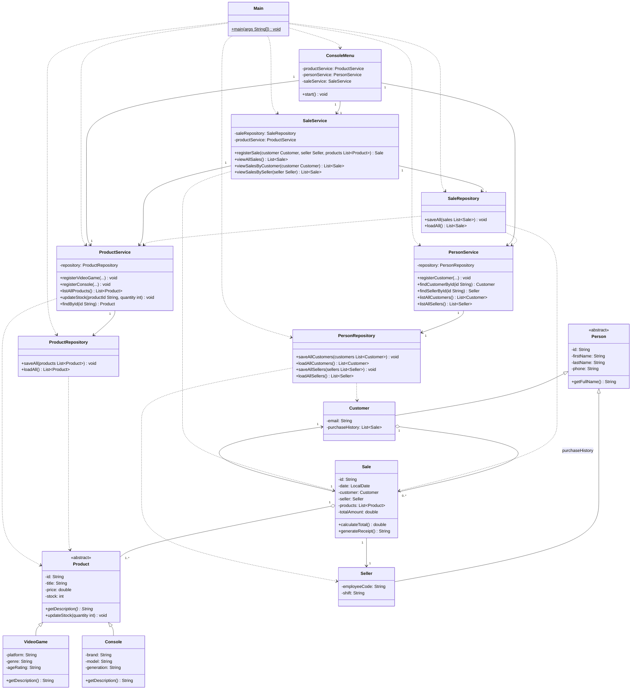

# Full Class Diagram — GameZone Unicesar

**Known layering exception:** `SaleRepository` (persistence layer) depends on `ProductService` and `PersonService` (service layer) to resolve customer, seller, and product references while reconstructing a `Sale` from `data/sales.csv`. This is a reverse dependency relative to the strict `persistence → model` rule described in [layers-diagram.md](layers-diagram.md), required because a sale's persisted form only stores ids, not full records. It is an intentional, documented trade-off rather than an oversight.
