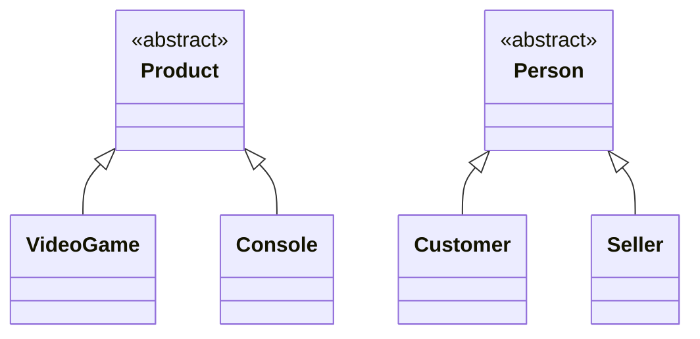

# Model Layer — Class Hierarchies

```mermaid
classDiagram
    class Product {
        <<abstract>>
    }
    class VideoGame
    class Console

    Product <|-- VideoGame
    Product <|-- Console

    class Person {
        <<abstract>>
    }
    class Customer
    class Seller

    Person <|-- Customer
    Person <|-- Seller
```
