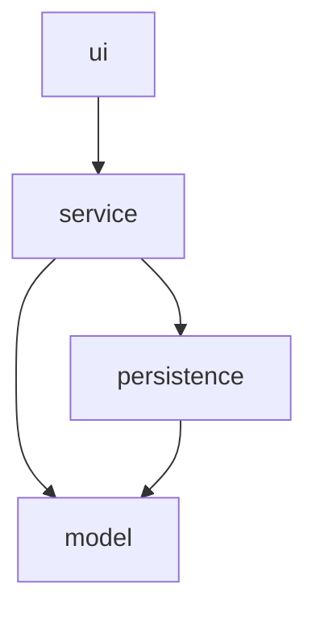

# Layer Dependency Diagram — GameZone Unicesar

Dependencies flow strictly inward, in one direction only: `ui` depends on `service`, `service` depends on both `persistence` and `model`, and `persistence` depends on `model`. The `model` layer depends on nothing else in the system. No layer may depend on a layer to its left in this diagram — for example, `model` must never depend on `persistence` or `service`, and `service` must never depend on `ui` — which keeps the domain model stable and independent while every outer layer can be extended, replaced, or tested without forcing changes on the layers it depends on.
